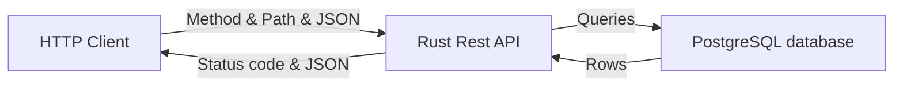

# Todo Rust API


My first Rust API.

It's a simple todo list API with CRUD operations.

This is a Proof of Concept to learn Rust with a practical example.



## Table of contents

- [Todo Rust API](#todo-rust-api)
  - [Table of contents](#table-of-contents)
  - [Installation](#installation)
    - [Rust](#rust)
    - [Sources](#sources)
  - [Usage](#usage)
    - [CURL collection](#curl-collection)
    - [Available operations](#available-operations)
    - [Schema](#schema)

## Installation

### Rust

```bash
curl --proto '=https' --tlsv1.2 -sSf https://sh.rustup.rs | sh
```

### Sources

Clone the repository and run the following command:

```bash
cargo run
```

### Database

This API works with a PostgreSQL database.

First start a Postgres container:

```bash
docker run --name postgres -e POSTGRES_PASSWORD=postgres -d -p 5432:5432 postgres
```

Then connect to the database and run the SQL script in `static/sql/` folder.

```bash
docker exec -it postgres psql -U postgres
```

## Usage

### CURL collection

See Shell script examples in `static/rest/` folder.

### Available operations

| Method | Endpoint | Description |
| --- | --- | --- |
| GET | /todos | Get all todos |
| GET | /todos/:id | Get a todo by id |
| POST | /todos | Create a todo |
| PUT | /todos/:id | Update a todo |
| DELETE | /todos/:id | Delete a todo |

### Schema

```json
{
  "id": 1,
  "title": "Do something",
  "completed": false
}
```
